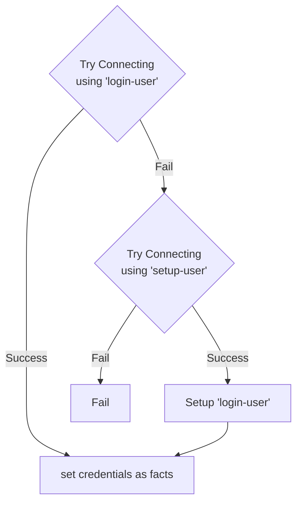

# Ansible Setup Role

Role for setting up hosts ith OS configuration

## SSH

This role will setup ssh users and logins using the ssh vars object of hosts

### Flow



1. Role will try to connect to host using 'loginuser' credentials
2. If connection succeded, store credentials as facts for the host, else continue
3. 

### Config

```yaml
vars:
  ssh: # shh configuration
    user:         <loginuser_username>    # Name of user to use for a standard login [required]
    key_file:     <loginuser_ssh_keyfile> # SSH Key to use for standard login [required] 
    su_user:      <root_username>         # User with elevated privileges [optional](default: root)
    su_pass_file: <root_password>         # Password for elevated user [required]
    setup: # setup config
      user:       <setupuser_username>    # Username for initial user [required]
      pass_file:  <setupuser_password>    # Password for initial user login [optional](default: none)
      key_file:   <setupuser_keyfile>     # SSH Key for initial user login [optional](default: none)
```